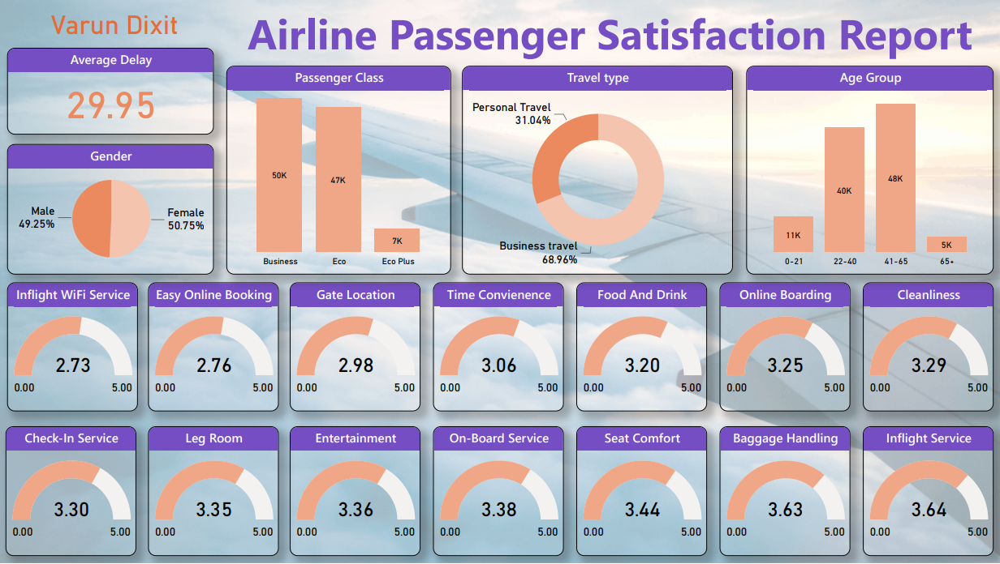

<h1>Airline Passenger Satisfaction Report</h1>

This repository contains a dashboard to analyze an airline satisfaction survey. The dashboard is built using PowerBI, and it utilizes a dataset that includes various features related to passenger demographics, travel details, and satisfaction levels.

<h2>Dataset</h2>

The <a href='https://www.kaggle.com/datasets/teejmahal20/airline-passenger-satisfaction'>dataset was found on kaggle</a> and it contains the following features:

<ul>
<li><b>Gender:</b> Gender of the passengers (Female, Male)
<li><b>Customer Type:</b> The customer type (Loyal customer, disloyal customer)
<li><b>Age:</b> The actual age of the passengers
<li><b>Type of Travel:</b> Purpose of the flight of the passengers (Personal Travel, Business Travel)
<li><b>Class:</b> Travel class in the plane of the passengers (Business, Eco, Eco Plus)
<li><b>Flight Distance:</b> The flight distance of this journey
<li><b>Inflight WiFi Service:</b> Satisfaction level of the inflight WiFi service (0: Not Applicable; 1-5)
<li><b>Departure/Arrival Time Convenience:</b> Satisfaction level of Departure/Arrival time convenient
<li><b>Ease of Online Booking:</b> Satisfaction level of online booking
<li><b>Gate Location:</b> Satisfaction level of Gate location
<li><b>Food and Drink:</b> Satisfaction level of Food and drink
<li><b>Online Boarding:</b> Satisfaction level of online boarding
<li><b>Seat Comfort:</b> Satisfaction level of Seat comfort
<li><b>Inflight Entertainment:</b> Satisfaction level of inflight entertainment
<li><b>On-board Service:</b> Satisfaction level of On-board service
<li><b>Leg Room Service:</b> Satisfaction level of Leg room service
<li><b>Baggage Handling:</b> Satisfaction level of baggage handling
<li><b>Check-in Service:</b> Satisfaction level of Check-in service
<li><b>Inflight Service:</b> Satisfaction level of inflight service
<li><b>Cleanliness:</b> Satisfaction level of Cleanliness
<li><b>Departure Delay in Minutes:</b> Minutes delayed when departure
<li><b>Arrival Delay in Minutes:</b> Minutes delayed when Arrival
<li><b>Satisfaction:</b> Airline satisfaction level (Satisfaction, neutral, or dissatisfaction)
</ul>
<h4><a href='airline_satisfaction.csv'>View the dataset here.</a><h4>

<h2>Purpose</h2>

The goal of this project is to create an interactive dashboard that allows users to explore and analyze passenger satisfaction levels based on different factors. The dashboard provides visualizations and insights to help airlines gain a better understanding of passenger preferences and areas for improvement.

<h2>Dashboard</h2>

The Dashboard was made using PowerBI, all demographics and satisfaction features were considered in the dashboard. This Power BI dashboard provides a comprehensive analysis of airline passenger satisfaction using the available demographic and satisfaction features. The dashboard allows users to explore various factors that contribute to passenger satisfaction and gain insights into the overall customer experience.

<h4><a href='./Airline Satisfaction Dashboard.pdf'>View the pdf file of the dashboard here.</a><h4>
<h4><a href='./Airline Satisfaction Dashboard.pbix'>Download the pbix file of the dashboard here.</a><h4>
